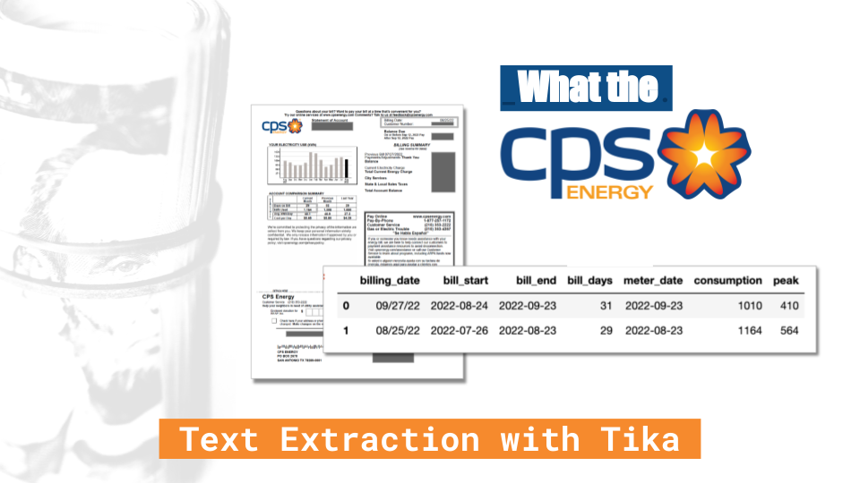

# What the CPS?

## Lesson Learned
### PII Masking
I am working with personal account data and wanted to share my work wihtout exposing PII. I used a hidden file to store sensitive information and manually block out sensitive data in image files. I also set up my notebooks so that the full text of extracted text would never be returned, only the parsed, non-PII data.

### Error Handling
There were only certain months that had peak charge information and when I tried parsing the bills outside of those months, without peak charges, I kept getting errors. This was a perfect use case for incorporating exception handling in my scripts using the `try` . . .  `except` syntax. This was, if a bill didn't have peak data, the value would be 0. 

 

Resource | Use | Description
:-- | :-- | :--
[How to Read Your CPS Bill](https://www.cpsenergy.com/content/dam/corporate/en/Documents/Your_Bill.pdf) | Data Definitions | CPS Energy guide to reading and understanding energy bill
[How to Read Your CPS Energy Bill](https://sanantonioreport.org/how-to-read-your-cps-energy-bill/) | Data Definitions | San Antonio Report breakdown of parts of electric bill
[Arrow v1.2.3](https://arrow.readthedocs.io/en/latest/#) Python Library | Date extraction and formatting | A Python library that offers a sensible and human-friendly approach to creating, manipulating, formatting and converting dates, times and timestamps
[wwo-hist 0.0.7](https://pypi.org/project/wwo-hist/) Python Library| Retrieving weather data |[www.worldweatheronline.com](www.worldweatheronline.com) historical weather data API wrapper 
[tika 1.24](https://pypi.org/project/tika/) Python Library | PDF text parsing and extraction | A python library based on the Apache Tika Java framework. *Used by the Fair Isaac Corporation (FICO), Goldman Sachs, NASA, Alfresco, Drupal, and many others.*
[Apache Tika]() Wikipedia Page | Text parsing and extraction | A content detection and analysis framework, written in Java, stewarded at the Apache Software Foundation. It detects and extracts metadata and text from over a thousand different file types, and as well as providing a Java library, has server and command-line editions suitable for use from other programming languages.

## Data Dictionary

Billing Info

Bill Detail | Label | Description
:-- | :-- | :--
Billing Date | `bill_date` | YYYY-MM-DD
Billing Period Start | `bill_start` | YYYY-MM-DD | Start date of the billing period
Billing Period End | `bill_end` | YYYY-MM-DD | End date of the billing period
Billing Period (days) | `bill_period_days` | *int*, number of days in billing period, `bill_end` - `bill_start`

Base Amounts

Base Figure | Label | Description
:-- | :-- | :--
Meter Read | `meter` | The meter reading
Energy Consumption | `consumption` | kWh Used
*Peak Consumption | `peak` | *float*, kWh used in excess of 600 during designated peak months;
Peak Consumption - All Months | `peak_all`| kWh used in excess of 600 for all months

Rates

Rate Detail | Label | Description
:-- | :-- | :--
Base rate | `consumption_rate` | *float*, per kWh charge for consumption
Peak Consumption Rate | `peak_rate` | *float*, per kWh charge for peak consumption
*Fuel Adjustment Rate | `fuel_rate` | *float*, The cost for fuel above the base rate
Regualtory Adjustment Rate | `regulatory_rate` | *float*, This covers two costs — the cost of statewide transmission and the cost CPS Energy pays to be a part of the Electric Reliability Council of Texas (ERCOT)

Charges

Charge Detail | Label | Description
:-- | :-- | :--
*Service Availablity Charge | `service_charge` | *float*, Covers the cost of metering and billing for your address, regardless of consumption
Energy Charge | `consumption_charge` | *float*, Recovers costs for power plants and other infrastructure based on the amount of electricity you use, `consumption` * `consumption_rate` 
Peak Consumption Charge | `peak_charge` | *float*, The Peak Capacity Charge covers the higher costs for electricity CPS Energy incurs during summer months when demand for electricity is at its highest
Fuel Adjustment Charge | `fuel_charge` | *float*, `fuel_rate` * `consumption`, The fuel adjustment covers the difference between the base rate customers are charged for natural gas use and how much it actually costs to get and deliver that gas. This charge fluctuates with the market price of natural gas.
Regulatory Adjustment Charge | `regulatory_charge` | *float*, `regulatory_rate` * `consumption` 
Total Bill Amount | `total_bill` | *float*, (1) `service_charge` + (2) `consumption_charge` + (3) `peak_charge` + (4) `fuel_charge` + (5) `regulatory_charge`

Weather Data

Weather Detail | Label | Description
:-- | :-- | :--
Weather Date
Feels Like Temp
Max Temp
Min Temp
Temp Spread
Humidity
Heat Index
Wind Chill
Wind Gust
Cloud Cover
Precipitation
Sun Hours
Sunrise
Sunset

Expanded Definitions 
(denoted by *asterisk above)

>****Service Availability Charge*** 
This is a fixed monthly charge to recover billing and metering. Billing costs include the paper the bill is printed on, the envelope and mailing costs. Metering covers the physical meter, transmission lines and poles, down to screws and bolts. Prior to the rate increase, this charge was $8.75.

>****Peak Consumption*** 
Applies during the months of June through September when an additional charge is applied for every kilowatt hour (kWh) used in excess of 600 kWh. The Peak Capacity Charge covers the higher costs for electricity CPS Energy incurs during summer months when demand for electricity is at its highest. CPS Energy says this charge is to encourage customers to conserve during months when energy demand is highest. 

>****Fuel Adjustment*** 
This rate fluctuates monthly based on the prices CPS Energy pays for fuel. When the market price of natural gas is high, this charge goes up. ***Customers also pay about $0.00087 per kilowatt hour toward the Winter Storm Uri recovery costs.***

>****Regulatory Adjustment*** 
 As part of ERCOT, CPS Energy is able to buy additional power from the market as needed and to sell excess power into the market. ERCOT is responsible for managing the statewide electric grid, and as such charges a mandatory fee to recover its administrative costs for managing the grid. 

